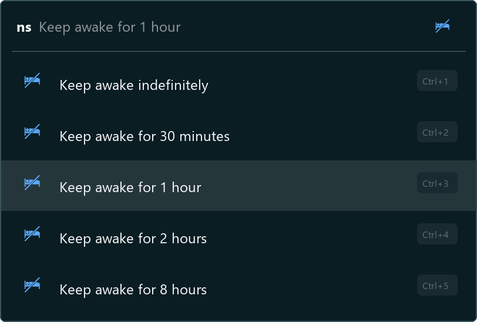
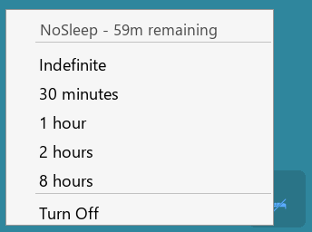
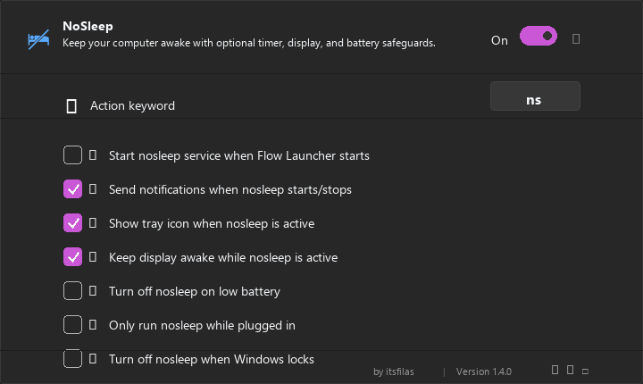

NoSleep for Flow Launcher
==================
A plugin for [Flow Launcher](https://github.com/Flow-Launcher/Flow.Launcher) that prevents your PC from sleeping, with optional display and battery safeguards.
NoSleep keeps your PC awake when active without having to change your Windows power settings.

### Usage

Type `ns` into [Flow Launcher](https://github.com/Flow-Launcher/Flow.Launcher) to choose how long to keep your PC awake. Press enter to activate; the first option (indefinitely) works just like the original toggle.



You can also type a custom duration directly:

| Command | Effect |
|---------|--------|
| `ns` | Show duration presets (indefinite, 30m, 1h, 2h, 8h) |
| `ns 3` | Keep awake for 3 hours |
| `ns 45m` | Keep awake for 45 minutes |
| `ns 1.5` | Keep awake for 1.5 hours (90 minutes) |
| `ns until 5pm` | Keep awake until a clock time |
| `ns 17:30` | Keep awake until 17:30 |
| `ns +30m` | Extend the current timer by 30 minutes |
| `ns s` | Show whether NoSleep is currently on or off |
| `ns screen off` | Keep the PC awake but allow the display to turn off |
| `ns screen on` | Keep both the PC and display awake |
| `ns off` | Turn off NoSleep |
| `ns help` | Show the built-in command help page |

When NoSleep is already active, typing `ns` shows a "Turn off" option at the top along with options to switch to a different duration. The current mode is hidden from the list since you're already using it.

### Tray Icon

Right-click the tray icon for quick access to duration presets, display mode, and turn off. The remaining time is shown at the top of the menu and in the tooltip on hover.



### Settings



> **Note:**  
> The image above shows the default settings for the plugin.

Safety options include display sleep mode, low-battery auto-off, plugged-in-only mode, and turning nosleep off when Windows locks.

## Installation

1. Install [flow launcher](https://github.com/Flow-Launcher/Flow.Launcher) if you haven't already.
2. Execute the following command in [flow launcher](https://github.com/Flow-Launcher/Flow.Launcher) query to install the plugin.

```cmd
pm install NoSleep by ItxFilas
```

or

Search for `NoSleep` within [flow launchers](https://github.com/Flow-Launcher/Flow.Launcher) plugin store
## How it Works

    Unlike utilities that spawn a separate background process, NoSleep runs entirely within the Flow Launcher process. It calls the native Windows API function `SetThreadExecutionState` from `kernel32.dll`
  on a lightweight background thread (`NoSleepPowerRequestThread`) to keep the system (and optionally the display) awake. Once the timer expires or NoSleep is turned off, the state is cleanly released and
  the thread terminates.
## Notices

NoSleep is maintained by [ItxFilas](https://github.com/ItxFilas). License notices are preserved in [LICENSE](LICENSE).
